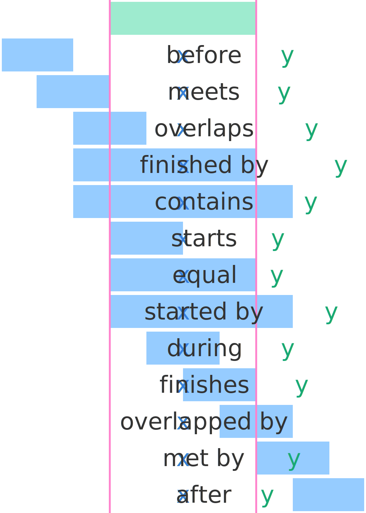

# Rampart


Determine how intervals relate to each other.

rampart.scala is a Scala implementation of [tfausak/rampart](https://github.com/tfausak/rampart), as Haskell library, which in turn was inspired by [James F. Allen's, Maintaining Knowledge About Temporal Intervals](https://hdl.handle.net/1802/10574).

The original project and this implementation use the terminology from that report.

It currently has a dependency on [cats](https://typelevel.org/cats/), specifically it's [Order](https://github.com/typelevel/cats/blob/master/kernel/src/main/scala/cats/kernel/Order.scala) typeclass.

## Usage

**Dependencies** in your `build.sbt`

```
resolvers += Resolver.bintrayRepo("oschrenk", "maven")
libraryDependencies += "dev.oschrenk" %% "rampart-scala" % "0.2.0"
```

**Example**

```scala
  import Interval.{relate, toInterval}
  import cats.implicits._

  val a = toInterval(1, 2)
  val b = toInterval(3, 7)
  relate(a, b) match {
    case Relation.Before => println("Before")
    case _      => throw new IllegalArgumentException("What is this?")
  }
```

## Terminology



## Publish

```
sbt publish
```
